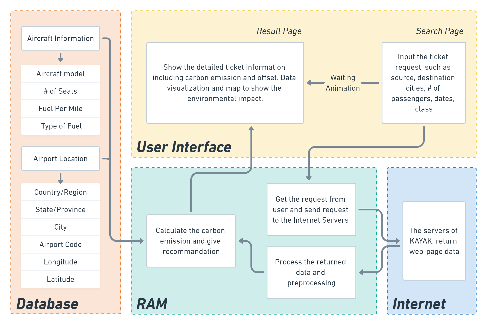

# Software Design: ZeroCarbonFly

overview

## 1. Users identification

Here, we focus on eco-friendly flight choice, and our target (TA) is the users traveling among U.S. cities.
The following table would illustrate the potential users, their purpose for this software, how to interact with it, and their skill levels through user stories.

| User type      | Name    |                                                              | User Story                                                   |
| -------------- | ------- | ------------------------------------------------------------ | ------------------------------------------------------------ |
| Traveler       | Kelly   |  | Kelly loves to travel around among U.S. cites. She cares about  climate change and she thinks travel pattern choices are the most effective  way to strive for a net-carbon zero world. She wants to check the date,  price, best choice, and see which flights would emit less amount of carbon.  Kelly is willing to pay some money for offsetting carbon and wants a safe and  secure interface for interacting with the ticket platform. Kelly’s job does  not involve technical skills and she values a simple user interface. |
| Technician     | Vincent |  | Vincent is the technician, he is highly technical and understands the  workflow of maintaining a user interface and providing technical support for  the web tool. He must ensure that the interface of our web tool is easy for  the user to navigate and that the UI design is smooth. For repairs, if the  web tool crashes, he must debug any problems that our web tool is facing in  order for it to be running all the time without errors. |
| Data Scientist | Ted     |  | Ted is a data scientist. He has a data analytics background and is  familiar with the impact of carbon emissions on other sectors, specifically  environmental aspects in a way to garner sympathy of the user to care about  their carbon impacts while traveling. He understands the workflow to connect  data among several sources, such as API. His work would focus on Data  Wrangling, Preprocessing and Training Data Development. He has to create our  own dataset by linking diverse existing data and calculating carbon emission  in three scenarios. For updates to the database, he must follow a standard  protocol to ensure the database is updated and data is not out of date, and  that our data is related to the airlines. In addition, he must monitor and  verify the accuracy of carbon credits to ensure that they are connected to  the related systems. |

## 2. Functional specification

|  | Kelly loves to travel among U.S. cities. She wants to check the cheapest flight price, the flight/airline with lowest carbon emission, and the carbon-neural ticket prices.  Kelly is willing to pay some money for offsetting carbon and wants a safe and secure interface for interacting with the ticket platform. Kelly’s job does not involve technical skills and she values a simple user interface. |
| --------------------------------------------------- | ------------------------------------------------------------ |

Kelly’s story reveals three use cases: **cheapest flight price, the flight/airline with lowest carbon emission, and the carbon-neural ticket prices.** The following section will show the user authentication by three use cases:

### **Cheapest flight price**

**Platform:** Display ‘Welcome to Zero Carbon Travel System’

**USER:** Enter departure city, destination city, date, Round trip or not, number of passengers, booking class, travel pattern(air default)

**Platform:** Show a list of all potential flights

**USER:** change the filter “sort by = Price”

**Platform:** Show a list of flights from the lowest prices within 10 options

### **Flight/airline with lowest carbon emission**

**Platform:** Display ‘Welcome to Zero Carbon Travel System’

**USER:** Enter departure city, destination city, date, Round trip or not, number of passengers, booking class, travel pattern(air default)

**Platform:** Show a list of all potential flights

**USER:** change the filter “sort by = carbon”

**Platform:** Show a list of flights from the lowest carbon emission option to conventional carbon emission

### **Carbon-neural ticket prices**

**Platform:** Display ‘Welcome to Zero Carbon Travel System’

**USER:** Enter departure city, destination city, date, Round trip or not, number of passengers, booking class, travel pattern(air default)

**Platform:** Show a list of all potential flights

**USER:** choose one of the desirable flight

**Platform:** display the percentage of carbon emission offset and price after taxing carbon fee: Conventional 0%, Low carbon 50%, Net-zero carbon: 100%(three scenarios) 

**USER:** choose one a price in three scenarios

**Platform:** direct to payment information

## 3. Design specification
This section wil talk abour the component design. 
The interatvie chart below shows the workflow of this platform creatation.
It has four main components:

**database:**
It tries to provide the structure of information we need in the future software design.
A dataframe included all data needed and it is the fundamental part of this platform.

**Ram:** 
It aims to get the request from users then sending the request to Internet server, 
pre-process the data, and calculate carbon information.

**Internet:**
It returns web-page data from KAYAK then senind to ram components.

**User interface:**
The user will input the ticket request in search page and 
the website will provide all information about carbon emission and offset with data visualization.

### Interactive Chart

## 4. Contribution
In order to work on these four components, our team seperate into two small groups, DATA and VISUALIZATION.
Each group has two members to work on software development.

**DATA group:** Chin-wei and Haoyu work on crawling and manipulating data.

**VISUALIZATION group:** Iman and Zining work on visualization and website design.

## 5. Project Plan
We use the project management idea to develop our platform.
All team members set the checkpoints from week 2 and 
check the progrss of each group in our weekly team meeting at 15:00-17:00 on Tuesdays.
The progress checkpoints are listed below:

week 2, week 3
Project idea brainstorming

week 4
Project proposal

week 5
Software Design

week 7
Tech review

week 8
data crawling
visualizaton design

week 9
data crawling&manipulation
demo visualizaton

week 10
project resository builtup
DATA & VISUALIZATION work combination
Project preview

week 11
resository finalization
Final presentation
