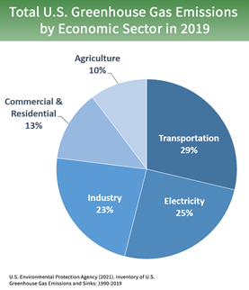
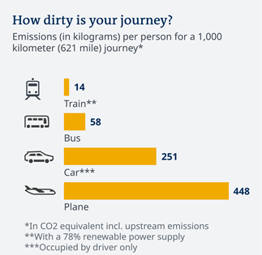
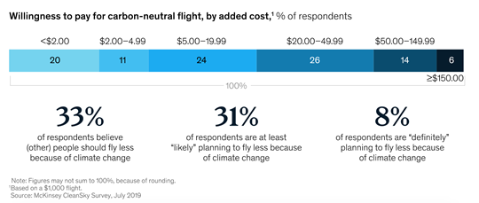
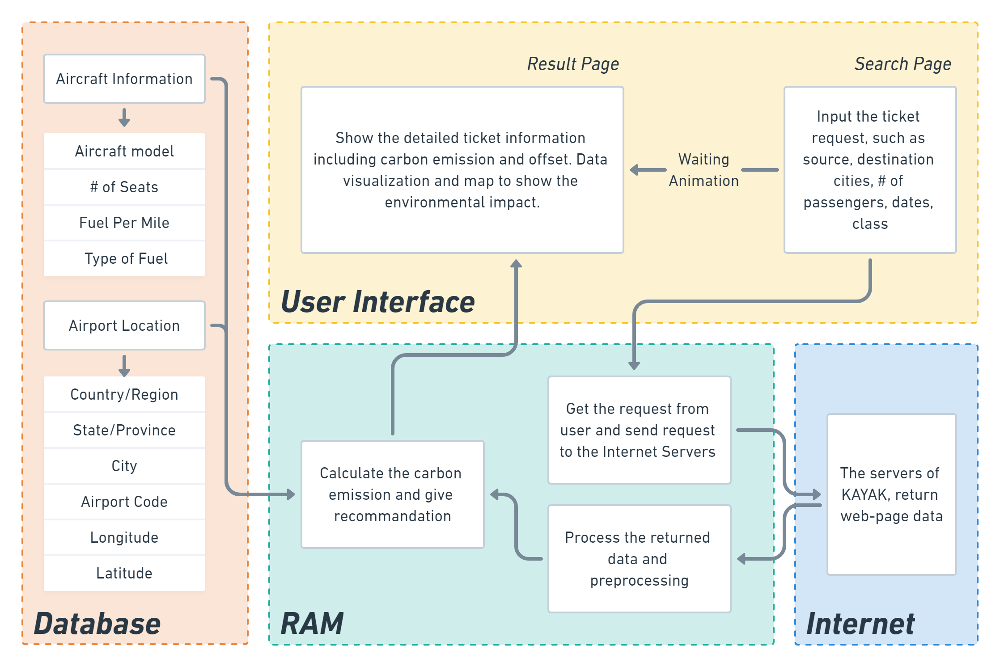
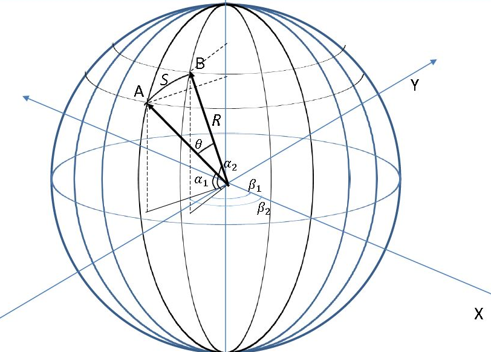
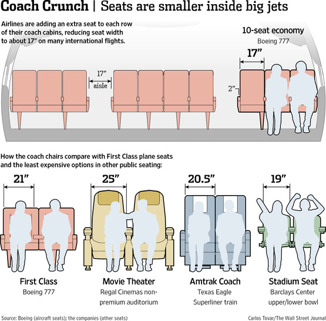
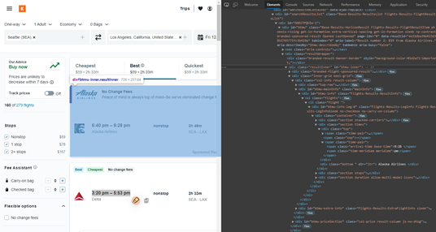

# Project Design Proposal: Zero-Carbon Travel Patterns Decision-making Platform

**University of Washington, CSE 583 Software Development for Data Scientists, Fall 2021**

**Team member: Chin-Wei Chen, Haoyu Yue, Iman Haji, Zining Cheng**

November 2021

## OVERVIEW

Climate change has become a crucial issue in contemporary society. The 2021 United Nations Climate Change Conference,COP26, is the 26th United Nations Climate Change conference. It is now being held in Glasgow, Scotland, United Kingdom, between 31 October and 12 November 2021. This conference is the first time that parties are expected to commit to enhanced ambition since COP21. Parties are required to carry out every five years, as outlined in the Paris Agreement, a process colloquially known as the 'ratchet mechanism' (Wikipedia, 2021). 137 countries have committed to carbon neutrality, as tracked by the Energy and Climate Intelligence Unit and confirmed by pledges to the Carbon Neutrality Coalition and recent policy statements by governments.

The US has pledged to achieve carbon neutrality by 2050, with a 2030 emissions target to be announced shortly. To meet the 2015 Paris Agreement, global greenhouse gas emissions need to be cut by 25– 50% over the next decade.

According to the U.S. Greenhouse Gas Emissions and Sinks report by EPA, the primary source of greenhouse gas emissions in the United States is Transportation, which composed 29 percent of 2019 greenhouse gas emissions(see Figure 1). These Greenhouse gas emissions are from transportation primarily come from burning fossil fuel for our cars, trucks, ships, trains, and planes. Over 90 percent of the fuel used for transportation is petroleum based, which includes primarily gasoline and diesel.

<div align="center">


Figure 1. Total U.S. Greenhouse Gas Emissions by Economic Sectors in 2019 (Source: EPA, 2021)

Among all the travel patterns, air travel is the fastest-growing source of carbon emissions and emits the largest greenhouse gas. When a user travels between cities, flying is often the cheapest option for journeys. However, the main reason is that the negative impact on the environment was not included in the price users have paid. Air fuel isn't taxed on its environmental externality at all. If the costs of environmental damage were reflected in flight ticket prices through effective carbon pricing, it would make other travel patterns, such as buses and trains, look a whole lot more attractive (Deutsche Welle, 2021). Additionally, **air travelers said they are willing to pay more for carbon-neutral tickets** with fliers aged 18 to 34 willing to pay the most, according to Mckinsey & Company’s research

<div align="center">


Figure 2. Greenhouse Gas Emissions among travel patterns (Source: DW, 2021)

<div align="center">

Figure 3. The survey output of willing to pay for carbon-neutral flight (Source: Mckinsey & Company’s, 2020)

Therefore, this project will first focus on “Air”. It **aims to influence individuals’ travel behaviors and commit to climate actions through providing a net-zero-carbon-oriented travel pattern decision platform. How to internalize environmental externality by presenting carbon costs and guide users to decide on low carbon travel patterns** would be the objectives of this project. The following sections would illustrate the key users, functional design, and component design.

## IDENTIFY USER

This project would like to present a comprehensive framework of the net-zero carbon travel patterns. Here, we focus on eco-friendly flight choice first, and our target (TA) is the users traveling among U.S. cities. The existing online metasearch engine for flights, such as Expedia and Google flight, only lists all the flight options for users, and “GREEN” is not the prioritized criteria for flight searching. However, the ticket prices did not reflect environmental costs.

If the United States of America would pursue carbon neutrality by 2050, every flight travel needs to consider carbon-neutral options by taxing carbon fees. Being a climate-smart traveler would be important in the near future. In order to conduct this project, the following table would illustrate the potential users, their purpose for this software, how to interact with it, and their skill levels through user stories.

Table 1. User stories

| User type      | Name    | Photo                                                        | User Story                                                   |
| -------------- | ------- | ------------------------------------------------------------ | :----------------------------------------------------------- |
| Traveler       | Kelly   |  | Kelly loves to travel around among U.S. cites. She cares about  climate change and she thinks travel pattern choices are the most effective  way to strive for a net-carbon zero world. She wants to check the date,  price, best choice, and see which flights would emit less amount of carbon.  Kelly is willing to pay some money for offsetting carbon and wants a safe and  secure interface for interacting with the ticket platform. Kelly’s job does  not involve technical skills and she values a simple user interface. |
| Technician     | Vincent |  | Vincent is the technician, he is highly technical and understands the  workflow of maintaining a user interface and providing technical support for  the web tool. He must ensure that the interface of our web tool is easy for  the user to navigate and that the UI design is smooth. For repairs, if the  web tool crashes, he must debug any problems that our web tool is facing in  order for it to be running all the time without errors. |
| Data Scientist | Ted     |  | Ted is a data scientist. He has a data analytics background and is  familiar with the impact of carbon emissions on other sectors, specifically  environmental aspects in a way to garner sympathy of the user to care about  their carbon impacts while traveling. He understands the workflow to connect  data among several sources, such as API. His work would focus on Data  Wrangling, Preprocessing and Training Data Development. He has to create our  own dataset by linking diverse existing data and calculating carbon emission  in three scenarios. For updates to the database, he must follow a standard  protocol to ensure the database is updated and data is not out of date, and  that our data is related to the airlines. In addition, he must monitor and  verify the accuracy of carbon credits to ensure that they are connected to  the related systems. |

## FUNCTIONAL DESIGN

|  | Kelly loves to travel among U.S. cities. She wants to check the cheapest flight price, the flight/airline with lowest carbon emission, and the carbon-neural ticket prices. <br />Kelly is willing to pay some money for offsetting carbon and wants a safe and secure interface for interacting with the ticket platform. Kelly’s job does not involve technical skills and she values a simple user interface. |
| ------------------------------------------ | ------------------------------------------------------------ |

Kelly’s story reveals three use cases: **cheapest flight price, the flight/airline with lowest carbon emission, and the carbon-neural ticket prices.** The following section will show the user authentication by three use cases:

### **Cheapest flight price**

**Platform:** Display ‘Welcome to Zero Carbon Travel System’

**USER:** Enter departure city, destination city, date, Round trip or not, number of passengers, booking class, travel pattern(air default)

**Platform:** Show a list of all potential flights

**USER:** change the filter “sort by = Price”

**Platform:** Show a list of flights from the lowest prices within 10 options

### **Flight/airline with lowest carbon emission**

**Platform:** Display ‘Welcome to Zero Carbon Travel System’

**USER:** Enter departure city, destination city, date, Round trip or not, number of passengers, booking class, travel pattern(air default)

**Platform:** Show a list of all potential flights

**USER:** change the filter “sort by = carbon”

**Platform:** Show a list of flights from the lowest carbon emission option to conventional carbon emission

### **Carbon-neural ticket prices**

**Platform:** Display ‘Welcome to Zero Carbon Travel System’

**USER:** Enter departure city, destination city, date, Round trip or not, number of passengers, booking class, travel pattern(air default)

**Platform:** Show a list of all potential flights

**USER:** choose one of the desirable flight

**Platform:** display the percentage of carbon emission offset and price after taxing carbon fee: Conventional 0%, Low carbon 50%, Net-zero carbon: 100%(three scenarios) 

**USER:** choose one a price in three scenarios

**Platform:** direct to payment information

## COMPONENT DESIGN 

### Interactive Chart

<div align="center">


### **CARBON OUTPUT FORMULA**

####  Distance calculation

There are two ways to calculate distance/ air mileage between two cities. One is the Vincenty's formula, which calculates the distance between latitude/longitude points on the earth’s surface, using an ellipsoidal model of the earth. 

<div align="center">


Figure 4: Vincenty's formula

The other, what we decide to use, is the Haversine formula, which calculates the distance between latitude/longitude points assuming a spherical earth (great-circle distance – the shortest distance between two points). 


<div align="center">

Figure 5: Haversine formula

#### Class difference ratio 

When evaluating the size of a seat, the main terms used are *pitch* and *width*. Seat pitch is defined as the space between a point on one seat and the same point on the seat in front of it. In almost all cases, seat pitch increases with class of travel (economy, business, first, etc.) For many carriers, the pitch in economy class is 29 to 32 inches. American Airlines' business class seat pitches in their former Boeing 767-200s were 62 inches, the largest in any short-haul business class. American Airlines have first-class flatbed seats in their Airbus A330-300s with a seat pitch of 94 inches. Seat width can be taken as the width enclosed by the armrests on each side that is the width available to sit in. In Economy class this width was typically 17 to 18 inches. Then, we decided to set the ratio of economic and first-class would be (21/17)*(94/30) = 3.87.

<div align="center">


Figure 6: Seats

#### Airplane type and their total output, seats 

````
```
For a  Boeing 747-400:
Distance: 926 km
Fuel used: 3.61 tons (the amount of fuel used including taxiing, take-off, cruising and landing.)
Seats: 164 (Max capacity)
Seat occupancy: 80%
Fuel use per passenger km: 36.6 g per passenger km
CO2 emissions: 115 g per passenger km (multiplying by 3.15 g CO2 per g fuel)
Cruising speed: 780 km per hour
CO2 emissions: 90 kg CO2 per hour

For a Boeing 747-400:
Distance: 5556 km
Fuel used: 59.6 tons
Seats: 416
Seat occupancy: 80%
Fuel use per passenger km: 32.2 g per passenger km
CO2 emissions: 101 g per passenger km (multiplying by 3.15 g CO2 per g fuel)
Cruising speed: 910 km per hour
CO2 emissions: 92 kg CO2 per hour

````

#### Data analysis

So for both aircraft, the emissions are around 90 kg CO2 per hour. This CO2 is generally emitted into the high atmosphere, and this is thought to have a greater greenhouse effect than CO2 released at sea level. The emissions are therefore adjusted by multiplication by a factor of 2.00 (see 'Radiative forcing' below) to give 180 kg CO2 equivalent per hour. Further allowance is needed for fossil fuel energy used in :extraction and transport of crude oil, inefficiencies in refineries (around 7%), aircraft manufacture and maintenance, and staff training, airport construction, maintenance, heating, lighting etc. The CO2 emissions are therefore rounded up and the Carbon Independent calculator takes a value of 250 kg i.e. 1/4 ton CO2 equivalent per hour flying.

### **SPIDER ROBOT AND DATA PROCESSING**

When we get the requests from the user on the main webpage, we need to search feasible routes and related information to do the next step, carbon calculation and recommendation. We explored existing datasets and APIs (Application Programming Interface) and found that there is no free and open-source data source including flight and ticket details. So, we decide to crawl data directly from the ticketing platforms, which will also facilitate us to obtain the data in the plug-in setting. In this step, we aim to use spider robots to gather analyzable data based on users’ inputs. 

Inputs (with type information): origin airport (char), destination airport (char), travel module (one-way, round-trip, etc.), date (date), traveler number (int), class (economy, business, first, etc), the number of bags (int). 

Outputs (with type information): airplane (char), price (float), travel time (float), stops (char), airlines (char), flight number (char), booking options (char). 

How does it work: We will support different ticketing platforms one by one. In this quarter, we will focus on the KAYAK (www.kayak.com). For example, when a user requests the two adult tickets from Seattle (SEA) to Los Angeles (LAX), a round trip (2021-12-03 & 2021-12-13), business class, the link for the request will be : 

*https://www.kayak.com/flights/SEA-LAX/2021-12-03/2021-12-13/business/2adults*

We could send the link and receive data from the KAYAK, which includes almost all the data we need (figure X). Then we generate the result dataframe and do data preprocessing, including data cleaning, filtering, renaming, etc.

<div align="center">

Figure 7: the data received from KAYAK

*How to use it with other components:* The data we scrape here will be used to calculate the carbon emission and do visualization for users in the next step. If we could design and write down a Chrome plug-in, it also could be one part of it. At the same time, this spider robot could be an independent python module for others to get the ticket information. 

### **CREATE DATABASE**

1. User Input: origin airport (3 letters code), destination (3 letters code), date, traveler number, class(economy 1, first-class 2)
2. Use Spider Robot to get the flight info from other website: airline, time length, price, stop city, airplane type
3. Developer input: seats number of different airplanes, distance calculate from origin and destination, class ratio, airplane carbon total carbon by fuel per mile

### **WEB DESIGN**

For the web design component, none of the subcomponents are readily available and must be implemented. The subcomponents that need to be implemented include building the main web layout, building the data visualization, building the map, and creating the graphic design UI/UX elements.

For each component, the specifications of the component are below:

#### **Main Webpage**

What it does: the main webpage for our web application in which users can input the details of the flight they are searching for and our application will display potential flights that the user can look through and book with emphasis on the environmental impact of each flight in terms of carbon footprint of each flight.

Inputs (with type information): inputs of the main webpage include origin (char), destination (char), date (date), traveler number (int), class (economy, business, first, etc)

Outputs (with type information): outputs of the main webpage include flight number (char), seats number (char), airline name (char), distance of flight (int), class (char), price (int), airplane carbon total carbon output database (int), best flight option (bool)

How to use with other components: the main webpage interface connects to the data visualization in which all flight options in the main webpage can be visualized with the data visualization component and users can filter potential flights by time, layovers, and other factors to view plots of flight price by carbon emissions.

#### **Data Visualization**

What it does: the data visualization will be created using Tableau software and will display plots of the environmental impact of each flight by price of flight, distance of flight, number of layovers, or other factors. The visualization can filter out certain variables for instance to only plot flights that have first class seat options available, flights with no layovers, etc.

Inputs (with type information): inputs would be same inputs as main webpage, with ability for user to input filters of variables

Outputs (with type information): output would be a plot of price of flights by carbon emissionHow to use it with other components: this subcomponent provides a visualization of the data that is outputted with the user search on the main webpage subcomponent.

#### **Map**

What it does: the map is a map of U.S. territories in which out of all flights displayed on the main webpage after a user completes a search, the map will show the origin, layover, and destination of potential flights. Maps can be visualized in Tableau or in a GIS software.

Inputs (with type information): inputs would be the same inputs as the main webpage.

Outputs (with type information): output would be a map of U.S. territories with the origin, layover, and destination of potential flights in which you can hover over a flight to see flight ID and flight details.

How to use it with other components: this subcomponent provides a geographic representation of the data that is outputted with the user search on the main webpage subcomponent. 

#### **Visualization For Environment Impact**

What it does: this subcomponent is a widget which translates the carbon emissions saved from the user’s chosen flight option compared to the cheapest priced flight option into “how many polar bears can be saved”. The carbon savings is the carbon emissions of the cheapest priced flight option minus the user’s chosen flight option. An algorithm would convert the carbon savings into how many years of a polar bear’s lifespan is saved.

Inputs (with type information): inputs of this widget would be the flight chosen by the user as flight ID (char)

Outputs (with type information): the output would be how many years of a polar bear’s lifespan is saved.

How to use other components: this subcomponent provides another way to assess the environmental impacts of the flight options given in the main webpage subcomponent.

## Reference

- Deutsche Welle. 2021. *Could eco-friendly flying be on the horizon?* https://www.dw.com/en/could-eco-friendly-flying-be-on-the-horizon/a-46403432
- Wikipedia. 2021. *United Nations Climate Change Conference.* https://en.wikipedia.org/wiki/2021_United_Nations_Climate_Change_Conference
- World Economic Forum. 2021. *The US wants to be carbon neutral by 2050. These 3 policies can make it possible.* https://www.weforum.org/agenda/2021/03/usa-us-american-climate-change-environment/
- Visual Capitalist. 2021. *Race to Net Zero: Carbon Neutral Goals by Country.*https://www.visualcapitalist.com/race-to-net-zero-carbon-neutral-goals-by-country/
- EPA. 2021. *Sources of Greenhouse Gas Emissions.* https://www.epa.gov/ghgemissions/sources-greenhouse-gas-emissions
- Tianwei Yin. 2018. *Flight Ticket Crawler - Git.*https://github.com/tianweiy/Flight-Ticket-Crawler 


